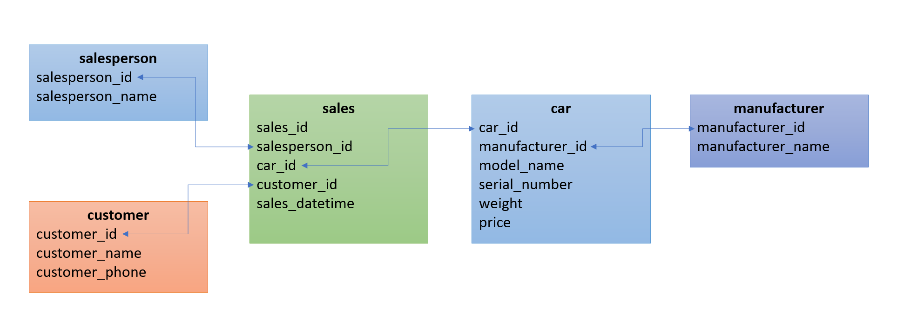

# Section 2: Databases


## Build and run the image
In the `Dockerfile`, `DDL.sql` will copy over to `/docker-entrypoint-initdb.d`. It will be run during the initialization.

```Dockerfile
COPY ./sql/DDL.sql /docker-entrypoint-initdb.d/DDL.sql
```

```sh
docker build . -t custom_postgres
docker run --name custom-postgres-2 -e POSTGRES_PASSWORD=gov -d -p 5432:5432 custom_postgres postgres
```

For dummy data, you can find in [dummy_data.sql](./sql/dummy_data.sql)


## Database modelling
The first column is always the primary key for the table.



## Solutions
Please find the solution [here](./sql/task.sql)
1) This can be achieved by using `sum` and `group by` as shown below.
```SQL
select
  cust.customer_name,
  SUM(ct.price) as total_spending
from
  customer cust
  inner join sales st on cust.customer_id = st.customer_id
  inner join car ct on st.car_id = ct.car_id
group by cust.customer_name
```

2) I use `row_number()` instead of `rank()` as I want to ensure it only shows top 3 for sales and quantity.
```SQL
select
  tbl.*
from (
  select 
    mt.manufacturer_name,
    SUM(ct.price) as total_sales,
    count(1) as total_quantity,
    row_number() over (order by SUM(ct.price) desc) as rk_sales,
    row_number() over (order by count(1) desc) as rk_quantity
  from
    sales st
    inner join car ct on st.car_id = ct.car_id
    inner join manufacturer mt on ct.manufacturer_id = mt.manufacturer_id
  where
    extract(year from st.sales_datetime) = extract (year FROM CURRENT_DATE)
    and extract(month from st.sales_datetime) =  extract (month FROM CURRENT_DATE)
  group by mt.manufacturer_name
) as tbl 
where
	tbl.rk_sales <= 3 or tbl.rk_quantity <=3
```