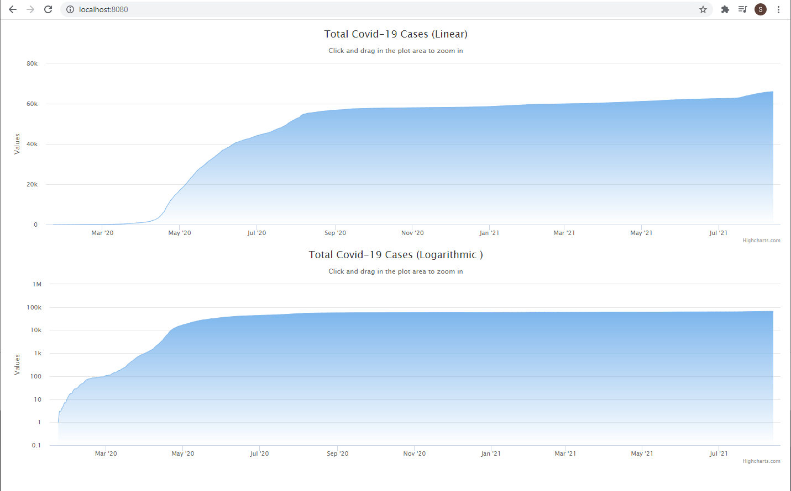

# Section 4: Charts and APIs

## Calling API
Use `JavaScript` to request for data.

## Charting
Create 2 different charts: linear scale and logarithmic scale

## Display the charts
1) Place both [index.html](./html/index.html) and [scripts.js](./html/scripts.js) under same directory.

2) Run from browser.